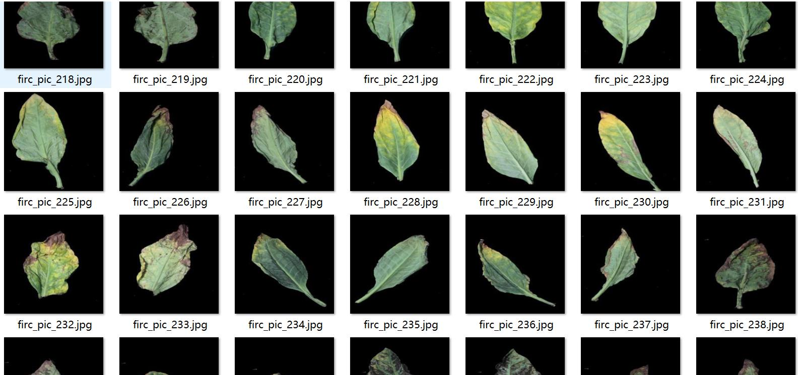
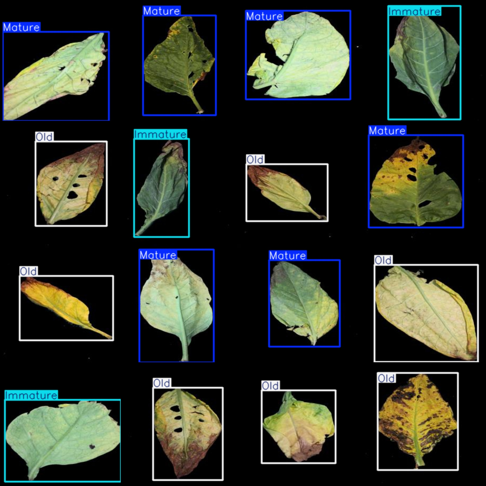
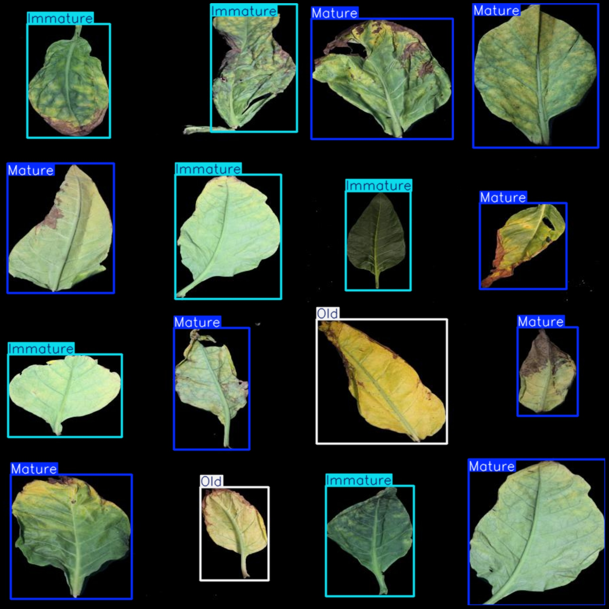

# Vaper Dataset with Detection of Essentiality, Targeted at 1240 Categories

Please note that all images are in black background, single leaves. For more details, please refer to the image preview.

Dataset format: Pascal VOC format + YOLO format (without split path txt file, only containing jpg images and corresponding VOC format xml files and yolo format txt files).

Number of images (jpg file count): 1240
Number of annotations (xml file count): 1240
Number of annotations (txt file count): 1240
Number of annotation categories: 3
Annotation category names (note that the order of yolo format categories does not correspond to this, but refer to the "labels" folder's "classes.txt" for consistency): ["Immature", "Mature", "Old"]
Each category has annotations for:
- Immature annotations = 332
- Mature annotations = 486
- Old annotations = 428
Total annotations per category: 1246
Number of images each category occupies:
- Immature occupies = 328
- Mature occupies = 484
- Old occupies = 428
Image resolution: 448x448
Annotation tool used: labelImg
Annotation rules: draw a rectangular box around the category
Important note: The dataset does not have been divided into training, validation, or test sets; it should be partitioned by the user.
Special statement: This dataset does not guarantee the accuracy of any trained models or weight files.
Image Preview:
Annotation Example:
## Images

Here is a pay link on Stripe ( https://buy.stripe.com/3cs8yP7sY87d0vu9AB ). Please contact me lonlonago@foxmail.com after funding $89, and I will send you a complete data files , thank you!

